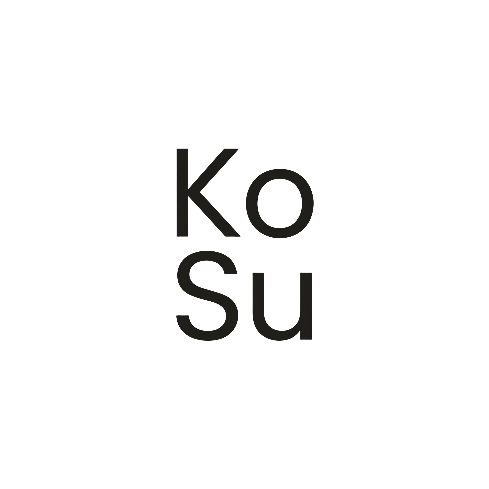

<div align="center">



# ☕ KoSu — Kopi Susu Botolan

### *Kopi Susu Terbaik yang Pernah Dimiliki Indonesia*

Diseduh dari biji **arabika pilihan**, dikemas dalam botol siap minum,
tersedia di minimarket terdekat.

[](https://developer.mozilla.org/en-US/docs/Web/HTML)
[](https://developer.mozilla.org/en-US/docs/Web/CSS)
[](#)
[](#)

</div>

---

## 📖 Tentang Project

**KoSu Landing Page** adalah sebuah halaman web statis yang dibuat untuk memperkenalkan brand fiktif **KoSu** — kopi susu botolan asli Bandung. Project ini dibangun dengan **HTML & CSS murni** (tanpa framework) sebagai latihan membangun landing page modern yang **clean**, **responsif**, dan **mudah di-maintain**.

> *"KoSu lahir dari sebuah keinginan untuk membuat sebuah masterpiece versi kopi."* ☕

---

## ✨ Fitur Unggulan

| Fitur | Deskripsi |
|-------|-----------|
| 🎨 **Desain Hangat** | Palet warna earth-tone (cokelat, krem) yang merepresentasikan kopi |
| 📱 **Fully Responsive** | Tampil sempurna di desktop, tablet, dan mobile |
| 🧭 **Smooth Scroll** | Navigasi antar-section terasa halus dan natural |
| ✋ **Hover Interaction** | Kartu varian rasa terangkat saat di-hover |
| 📌 **Sticky Header** | Navigasi selalu mudah dijangkau saat scrolling |
| 🚀 **Zero Dependencies** | Murni HTML & CSS — cepat, ringan, no bloat |

---

## 🍶 Varian Rasa

<div align="center">

|  |  |  |
|:---:|:---:|:---:|
| **Kopi Susu Signature** | **Kopi Coklat** | **Kopi Alpukat** |
| Signature ala KoSu | Dengan coklat pilihan | Cita rasa alpukat segar |

</div>

---

## 🛒 Tersedia di

```
🏪 IndoApril    🏪 Alfamarch    🏪 Jajangmart    🏪 KoSumart
```

---

## 🗂️ Struktur Project

```
kosu-landing-page/
├── 📄 index.html        # Halaman utama landing page
├── 🎨 style.css         # Styling & responsive design
├── 🖼️ images/
│   ├── logo.png         # Logo brand KoSu
│   ├── kopi-susu.png    # Varian Signature
│   ├── kopi-coklat.png  # Varian Coklat
│   └── kopi-alpukat.png # Varian Alpukat
└── 📘 README.md         # Dokumentasi project
```

---

## 🚀 Cara Menjalankan

### 1️⃣ Clone repository

```bash
git clone https://github.com/dappervire/kosu-landing-page.git
cd kosu-landing-page
```

### 2️⃣ Buka di browser

Cukup buka file `index.html` langsung di browser favorit kamu.

> 💡 **Tips:** Untuk pengalaman developer yang lebih baik, gunakan ekstensi **Live Server** di VS Code — auto-reload setiap kali file disimpan.

---

## 🎨 Palet Warna

| Warna | Hex | Penggunaan |
|-------|-----|------------|
| 🟫 Cokelat Tua | `#2a1810` | Teks utama & footer |
| 🟤 Cokelat Kopi | `#8b4513` | Hover & accent |
| 🟡 Krem Hangat | `#f5f0e8` | Background hero & tentang |
| 🟨 Krem Tua | `#ede4d3` | Background varian & beli |
| ⚪ Putih Susu | `#fdfaf5` | Background card |

---

## 📐 Section Halaman

1. **🏠 Hero** — Headline utama & gambar produk signature
2. **🍶 Varian** — Tiga varian rasa unggulan dalam grid card
3. **📖 Tentang** — Cerita di balik brand KoSu
4. **🏪 Beli** — Daftar minimarket tempat produk tersedia
5. **🔗 Footer** — Copyright & tautan media sosial

---

## 🛠️ Tech Stack

- **HTML5** — Struktur semantik
- **CSS3** — Flexbox, Media Queries, Transitions
- **Responsive Design** — Breakpoint di `768px`

---

## 📱 Connect with Us

<div align="center">

[](https://www.instagram.com/unguentuum)
[](https://www.tiktok.com/@dappervire)

</div>

---

## 📜 Lisensi

```
© 2026 KoSu. All rights reserved.
```

Project ini dibuat untuk tujuan pembelajaran dan portofolio.

---

<div align="center">

**Dibuat dengan ❤️ dan ☕ di Bandung**

⭐ *Jika kamu suka project ini, jangan lupa kasih star ya!* ⭐

</div>
